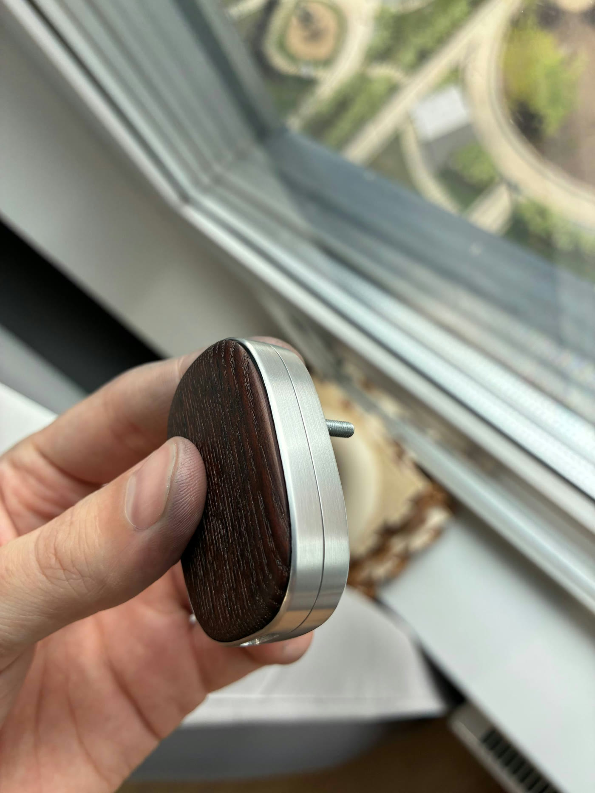
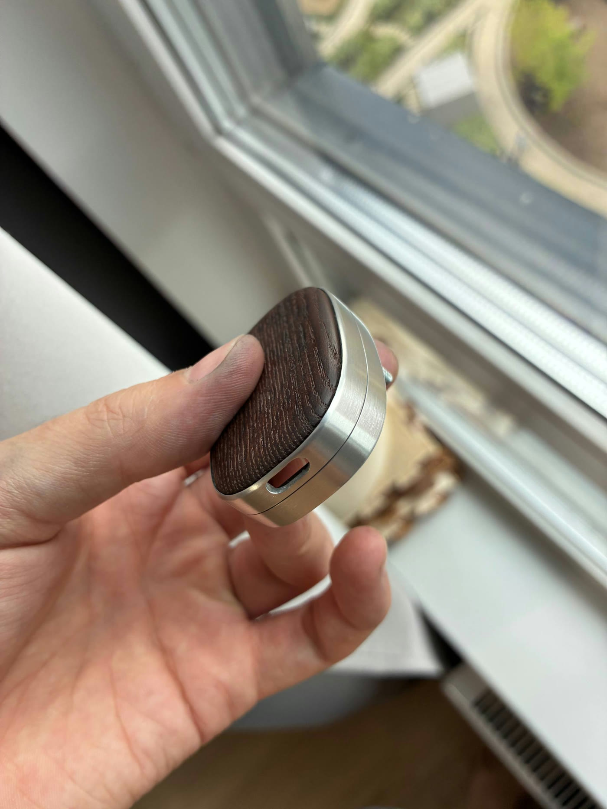
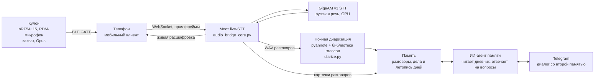

# Помнит

Кулон и приложение, которые помогают не терять важное из разговоров.
Запись превращается в расшифровку, краткую суть, дела и летопись дней.
К прошлому разговору можно вернуться по дате или задать вопрос своей памяти.

| Корпус из дерева и алюминия | Вид на разъём USB-C |
|---|---|
|  |  |

Это фотографии изготовленного вручную корпуса, а не рендер серийного изделия.
Деревянная лицевая часть покрыта маслом, алюминий отшлифован.

> Это публичная техническая витрина действующего личного прототипа. Показаны
> код обработки звука и прошивка. Личные записи, дневник, секреты и мобильное
> приложение в репозиторий не входят. Сборка кулона и работа от аккумулятора
> ещё отлаживаются.

## Как это устроено



- **Кулон** (`firmware/`) — плата Seeed XIAO nRF54L15 Sense, Zephyr.
  Запись звука, Opus 16 кГц и передача по BLE на телефон. Нынешний способ
  голосового вызова через подмешанный аудиоклип — временный.
- **Аудиомост** (`server/`) — принимает аудиопоток, режет его на
  куски, отделяет речь от тишины порогом от собственного шумового пола
  комнаты (`speech_gate.py`), гоняет через STT и возвращает живую
  расшифровку на экран телефона. Параллельно пишет WAV для ночного разбора
  и ловит голосовые команды («Ватсон, поставь напоминание…»).
- **STT** (`server/gigaam_server.py`) — GigaAM v3 (SOTA на русском, MIT),
  локально на GPU. API совместим с whisper-server: движки переключаются
  одной переменной окружения.
- **Диаризация** (`server/diarize.py`) — pyannote размечает «кто говорил»,
  владелец опознаётся по эталону голоса, собеседники — по накопительной
  библиотеке: каждый разговор оставляет отпечатки голосов, ночное обучение
  подтверждает имена по контексту — система постепенно узнаёт окружение.
- **Диалог с памятью** — ИИ-агент (Claude в headless-режиме) читает базу
  дневника и отвечает на вопросы в Telegram и в мобильном приложении.
  Канал приложения использует только разрешённый доступ к личной памяти.

## Физический прототип

Сейчас в работе корпус из дерева и алюминия на фотографиях выше. Старые
печатные варианты и неточные рендеры убраны из текущей витрины; они остались
в истории Git и локальном архиве.

Идея «книги жизни» — развивать летопись по дням до связного рассказа и
аудиоглав. Полноценную аудиокнигу не выдаём за готовую функцию.

## Состав репозитория

```
server/     мост live-STT, детектор речи, GigaAM-сервер, диаризация
firmware/   Zephyr-приложение кулона + конвейер сборки и заливки
hardware/   реальные фотографии нынешнего корпуса
```

Все адреса, порты и пути в коде — примеры; боевые значения живут в `.env`
закрытого контура. Секретов в репозитории нет.

---

## Pomnit (EN)

Pomnit is a wearable pendant and app that turn conversations into transcripts,
summaries, action items and a dated life chronicle. The photos above show the
real hand-built wooden and aluminum enclosure. This public repository contains
a technical showcase, not personal recordings or the private memory database.

Все права защищены / All rights reserved.
