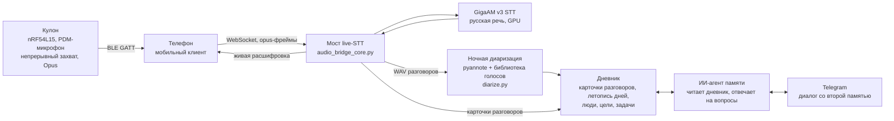
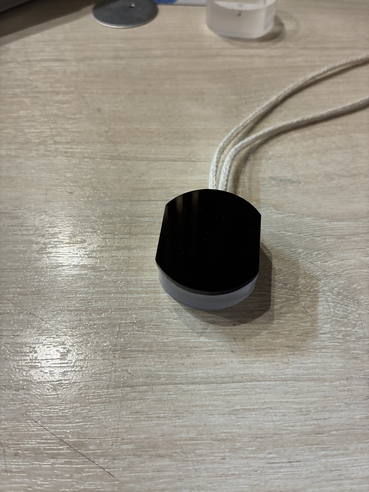
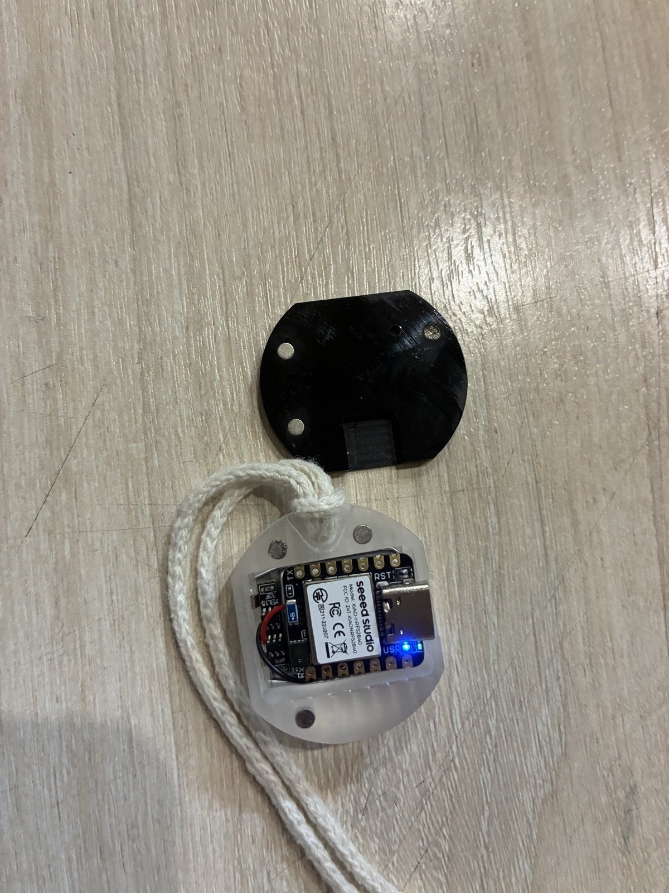
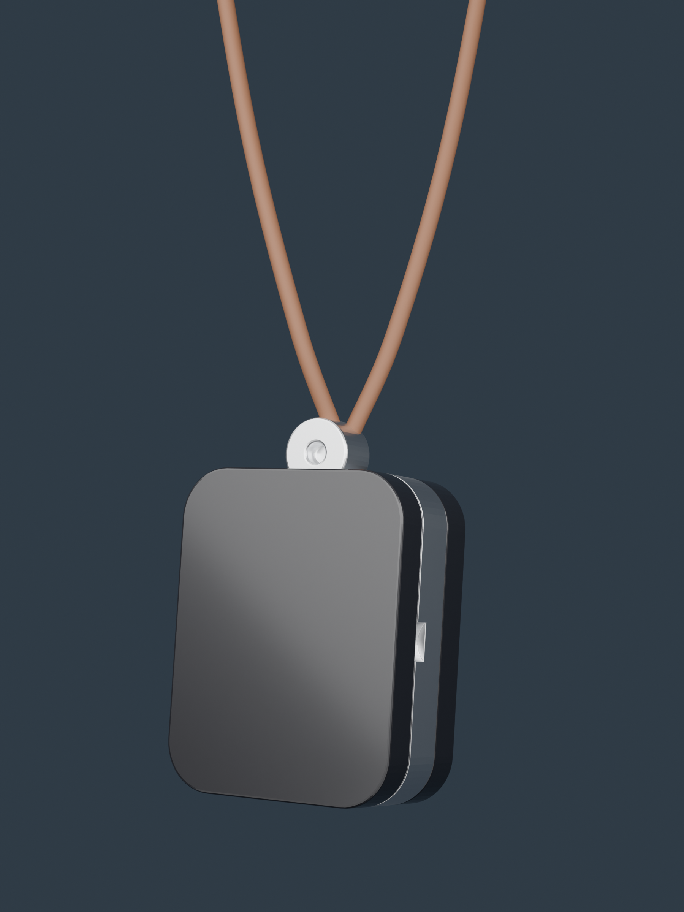
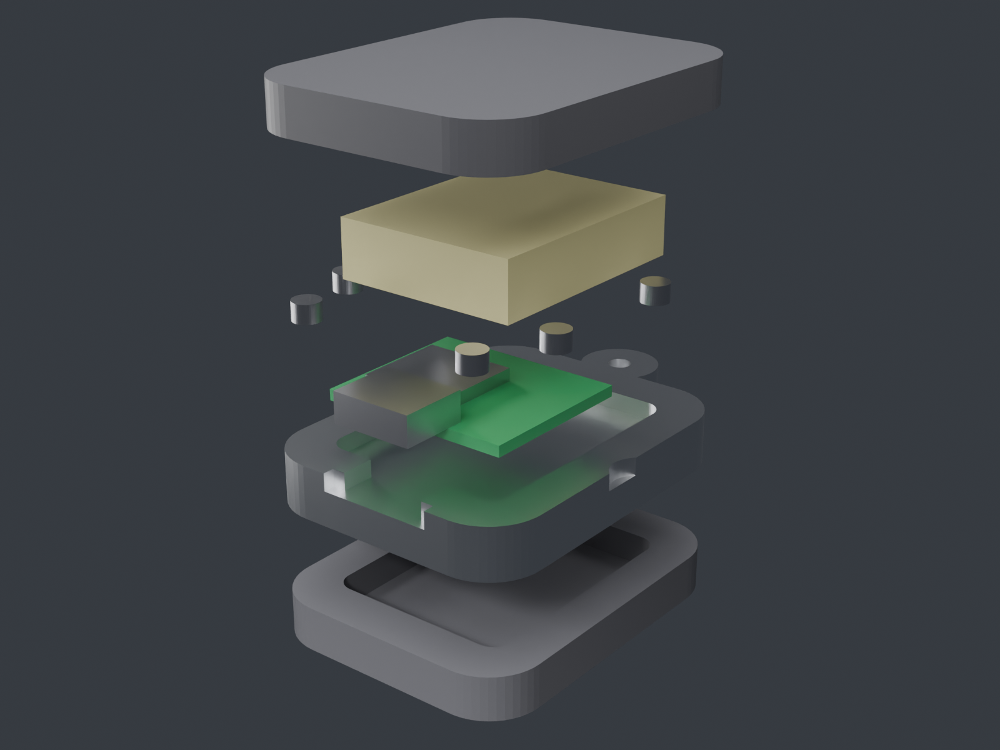
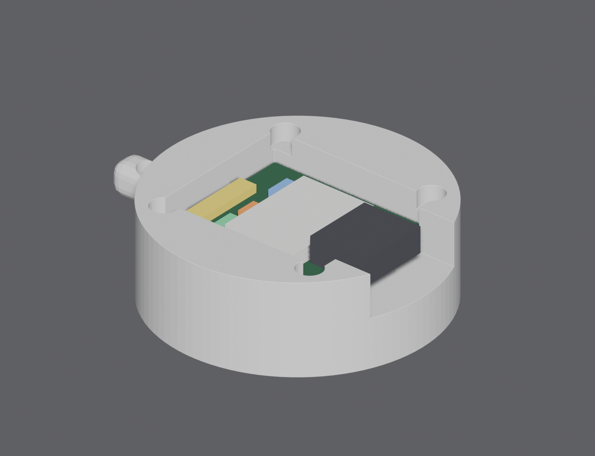
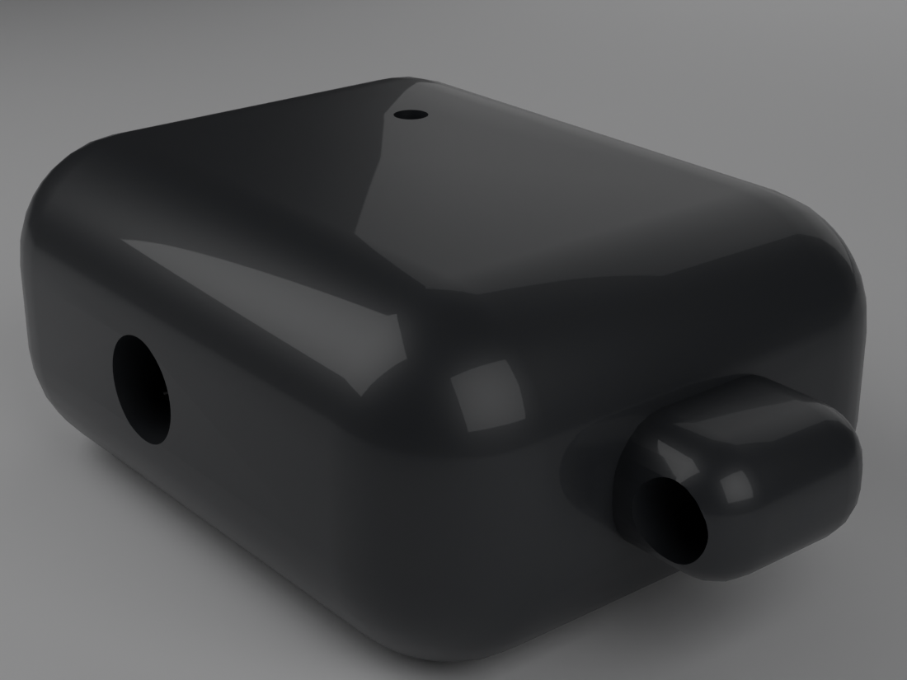
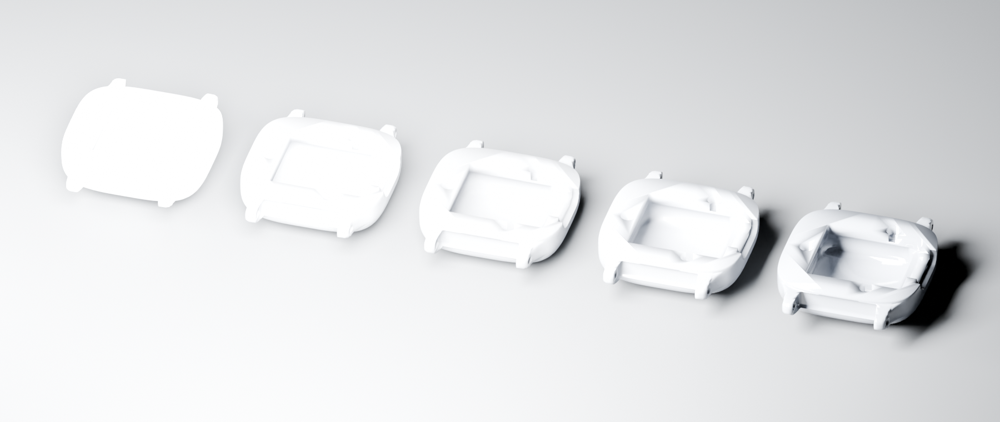

# Вторая память

Носимый кулон-диктофон, который слушает день своего владельца, превращает
услышанное в дневник — и даёт со своей памятью разговаривать.

**Человек слышит разговор — система слышит обязательства.** Каждая беседа
становится карточкой с сутью и задачами, каждый день — рассказом в летописи,
каждый собеседник — профилем, который система со временем узнаёт по голосу.
Перед встречей можно спросить: «о чём мы договаривались в прошлый раз?» —
и получить ответ по собственным записям.

> **Честно о том, что здесь лежит.** Это витрина личной системы, работающей
> в проде с июля 2026 года: кулон носится каждый день, конвейер крутится
> круглосуточно. Показан код конвейера (мост, STT, диаризация) и прошивка
> кулона. Личные данные, база дневника, Telegram-бот и REST-фасад мобильного
> приложения — в закрытом контуре и в репозиторий не входят.

## Как это устроено



- **Кулон** (`firmware/`) — плата Seeed XIAO nRF54L15 Sense, Zephyr.
  Непрерывный захват звука, Opus 16 кГц, стрим по BLE. Двойной тап по
  корпусу — голосовой вызов ассистента: прошивка подмешивает в поток клип
  позывного «Доктор Ватсон», и сервер слышит его как обычную речь.
- **Мост** (`server/audio_bridge_core.py`) — принимает аудиопоток, режет его на
  куски, отделяет речь от тишины порогом от собственного шумового пола
  комнаты (`speech_gate.py`), гоняет через STT и возвращает живую
  расшифровку на экран телефона. Параллельно пишет WAV для ночного разбора
  и ловит голосовые команды («Ватсон, поставь напоминание…»).
- **Приватность встроена в голос**: фраза «Ватсон, не пиши это» отбрасывает
  текущий разговор целиком — и аудио, и его вебхук-версию. Это право любого
  участника разговора, не только владельца.
- **STT** (`server/gigaam_server.py`) — GigaAM v3 (SOTA на русском, MIT),
  локально на GPU. API совместим с whisper-server: движки переключаются
  одной переменной окружения.
- **Диаризация** (`server/diarize.py`) — pyannote размечает «кто говорил»,
  владелец опознаётся по эталону голоса, собеседники — по накопительной
  библиотеке: каждый разговор оставляет отпечатки голосов, ночное обучение
  подтверждает имена по контексту — система постепенно узнаёт окружение.
- **Диалог с памятью** — ИИ-агент (Claude в headless-режиме) читает базу
  дневника и отвечает на вопросы в Telegram и в мобильном приложении.
  Канал приложения — строго read-only: агенту оставлены только инструменты
  чтения, а границы прописаны прямо в задании (см. `_ask_brain_sync`).
- **Несколько носителей** — у каждого кулона свой uid, своя папка аудио и
  своя база: чужие разговоры не попадают в дневник владельца, чужой «Ватсон»
  не управляет его ботом.

## Железо (`hardware/`)

Живое устройство — то самое, что носится каждый день:

| | |
|---|---|
|  |  |
| Печатный корпус, чёрная крышка, шнур | Внутри: плата XIAO (BLE SoC, PDM-микрофон), аккумулятор под платой |

Рендеры поколений корпуса:

| | |
|---|---|
|  |  |
| Кулон на шнурке — как устройство выглядит в носке | Разнесённая сборка: крышка, батарея, плата, основание |
|  |  |
| Посадка платы nRF54L15 в корпус текущего поколения | Ранний корпус первого поколения |



Стадии доводки поверхности: от сырой печати до глянца. Корпуса спроектированы
под три техпроцесса — 3D-печать, ЧПУ-фрезеровку и литьё — и прошли несколько
поколений носки на живом устройстве.

## Состав репозитория

```
server/     мост live-STT, детектор речи, GigaAM-сервер, диаризация
firmware/   Zephyr-приложение кулона + конвейер сборки и заливки
hardware/   рендеры корпусов
```

Все адреса, порты и пути в коде — примеры; боевые значения живут в `.env`
закрытого контура. Секретов в репозитории нет.

---

## Second Memory (EN)

A wearable pendant recorder that listens to its owner's day and turns it
into a searchable life chronicle. A person hears a conversation — the system
hears the commitments. Pipeline: nRF54L15 pendant (continuous audio capture,
Opus over BLE) → phone → local server (GigaAM v3 Russian STT + pyannote
diarization with a cumulative voice library — the system gradually learns to
recognize the people around you) → AI diary agent → Telegram chat with your
own memory. Voice privacy is built in: saying "Watson, don't write this down"
drops the current conversation entirely. This is a showcase of a personal
system running in production since July 2026; the pipeline code is public,
the personal data and diary stay in a private contour.

Все права защищены / All rights reserved.
