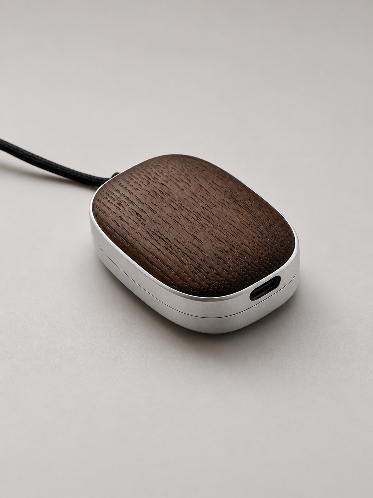
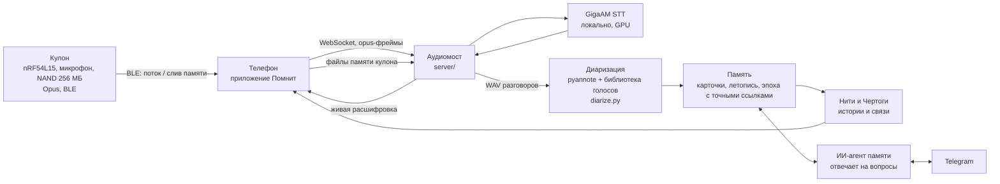

# Помнит

Кулон и приложение, которые помогают не терять важное из разговоров.
Запись превращается в расшифровку, краткую суть, дела и летопись дней; к прошлому
разговору можно вернуться по дате, а связанные темы собираются в «Нити» и «Чертоги».

<p align="center">
  
</p>

| Профиль корпуса | Разъём USB-C и стык пластин |
|---|---|
|  |  |

Изображения подготовлены по фотографиям изготовленного вручную прототипа: фон заменён
на нейтральный. Это не фотографии серийного изделия.

> Публичная техническая витрина действующего прототипа. Здесь показаны файлы обработки
> звука. Прошивка кулона — отдельная аппаратная линия, в витрину не входит. Личные записи, база памяти, секреты, мобильное приложение и
> полный серверный код в этот репозиторий не входят — они живут в закрытых репозиториях
> (`second-memory-app`, `pomnit-server`), доступ проверяющим предоставляется по запросу.

## Состояние на 23.09.2026

- **Приложение** (iOS, построено на открытом коде под MIT и переработано под «Помнит», сборка 1.0.543/1001): запись с кулона и с микрофона
  телефона, живая расшифровка, Лента разговоров, Дела, Летопись, Чат с памятью, «Нити» и
  «Чертоги» — два вида одной связанной памяти; экран памяти кулона с режимами слива.
- **Кулон**: плата Seeed XIAO nRF54L15 Sense, Opus 16 кГц по BLE, вызов ассистента двойным
  тапом как цифровое событие (без подмены звука), буфер памяти NAND 256 МБ: день пишется в
  кулон и сливается в приложение и на сервер, когда телефон рядом. Корпус — дерево и алюминий.
- **Сервер**: приём потока и файлов, детектор речи по шумовому полу комнаты, GigaAM (русская
  речь, локально на GPU), разметка «кто говорил», карточки разговоров, сохранённая летопись,
  память с точными ссылками на реплики и историями, Telegram-бот, API приложения.
- **Сайт**: `pomnit-site`.

## Как это устроено



- **Аудиомост** (модуль в `server/`) — принимает поток и файлы, режет на куски, отделяет
  речь от тишины порогом от собственного шумового пола (`speech_gate.py`), гоняет через STT,
  возвращает живую расшифровку на телефон, пишет WAV для разметки, ловит голосовые команды
  («Ватсон, поставь напоминание…»). Записи хранятся бессрочно, диск защищён от переполнения.
- **STT** (`server/gigaam_server.py`) — GigaAM (MIT), локально на GPU; API совместим с
  whisper-server, движки переключаются одной переменной окружения. `hallucinations.py` —
  фильтр типовых галлюцинаций распознавания.
- **Диаризация** (`server/diarize.py`) — pyannote размечает «кто говорил»; имя голосу даётся
  только явно, автоматического угадывания нет: реплика без подтверждённого говорящего никому
  не приписывается.
- **Память** — активная эпоха с чистого листа; сначала точный источник (реплики с таймкодами),
  потом смысл: карточки разговора, летопись дня, истории с проверяемыми ссылками на источник.
  ИИ-агент отвечает на вопросы в Telegram и в приложении.

## Состав репозитория

```
server/     аудиомост, детектор речи, фильтр галлюцинаций, GigaAM-сервер, диаризация
            (актуальные версии; имена окружения заменены на примеры)
hardware/   фотографии нынешнего корпуса
```

Все адреса, порты и пути в коде — примеры; боевые значения живут в `.env` закрытого контура.
Секретов в репозитории нет.

---

## Pomnit (EN)

Pomnit is a wearable pendant and an app that turn conversations into transcripts, summaries,
action items, a dated life chronicle and linked memory ("threads" and "rooms"). The photos above
show the real hand-built wooden and aluminum enclosure. This public repository is a technical
showcase (audio processing files); the app, the firmware and the full server live
in private repositories and contain no personal recordings or the private memory database.

Все права защищены / All rights reserved.
